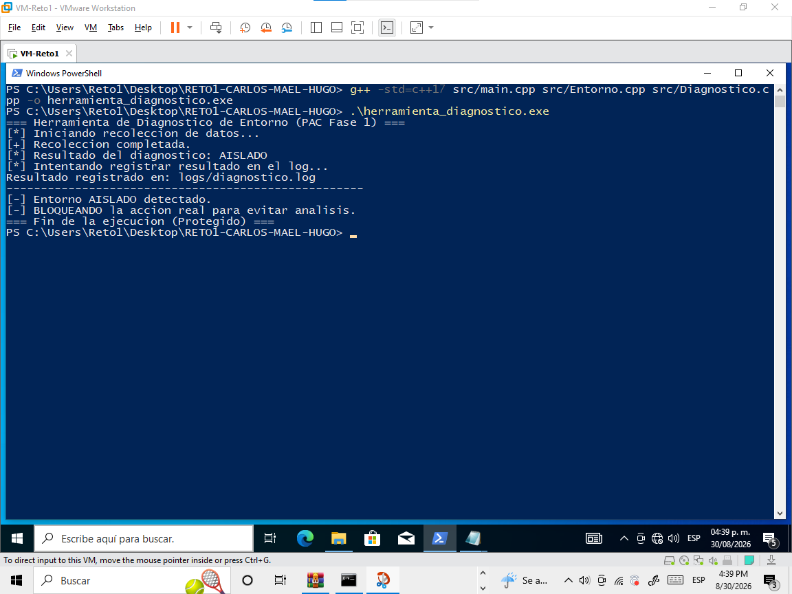
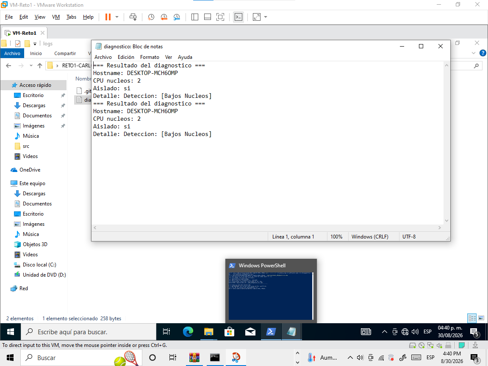

# Reto 1 — Entorno Aislado y Herramienta de Diagnóstico en C++

Programación Avanzada para Ciberseguridad (PAC) — Fase 1

> ⚠️ **Este README es una plantilla.** Bórrenlo y reescríbanlo con su propia información antes de entregar — no debe quedar ningún texto entre `[corchetes]`.

## Equipo

| Integrante | Rol / aportación |
|---|---|
| Carlos Alexis Vargas Flores | [Modulos de Entorno , main parcial, investigación y erorres |
| Hugo Gael Arredondo Esparza | Modulos de Diagnostico, investigacion de codigo y correccion de errores de ejecucion |
| Luis Mael Treviño Mares | Documentación y preparación del entorno aislado para la ejecución del reto |

## Descripción del proyecto

[Expliquen en 3-5 líneas qué hace su programa: cómo detecta si está en un entorno aislado, qué dato del sistema o de la red utilizan para decidirlo, y qué acción "real" simulan cuando detectan que NO están aislados.]

## Cómo compilar

Todos los archivos `.cpp` se compilan juntos en un solo paso:

```bash
g++ -std=c++17 src/main.cpp src/Entorno.cpp src/Diagnostico.cpp -o herramienta_diagnostico.exe
```

## Cómo ejecutar

```bash
.\herramienta_diagnostico.exe
```

En Windows, el ejecutable se genera como `herramientadiagnostico.exe`.

## Comportamiento esperado

**Dentro del entorno aislado:**
- Pantalla: Se imprime `Entorno Aislado: SI`. Se nos muestra una alerta por pocos núcleos (<=2), y que hay una presencia de drivers de VMware (`vmhgfs.sys `, etc)
- Logs: Nos lanza el mensaje que se con varias características y detalles que nos dan a entender que efectivamente, en donde se ejecuto el programa es un entorno aislado.

## Evidencia
### 1. Pantalla del entorno aislado
Se tomo una captura de pantalla del estado en cuento se ejecuto el programa para detectar si se encontraba dentro de un entorno aislado.


### 2. Log de Diagnostico
En cuanto se ejecuto el programa, este genero un log en donde mostraba características y detalles del diagnostico.


## 3. Fuera del entorno aislado (en otra VM sin aislar, o en su equipo host):**
Se realizo una ejecución del codigo en un entorno fuera sin aislar en un equipo de host, donde se imprime los datos del resultado del diagnostico diciendos el resultado en pantalla y aparte con el nombre del log. Donde si se ve, se muestra el hostname, nucleos y la frase "aislado: no".


## Estructura del proyecto

```
Reto1-NombreDelEquipo/
├── README.md                 <- este archivo
├── src/
│   ├── main.cpp               <- punto de entrada del programa
│   ├── Entorno.h               <- declaraciones: detección de entorno
│   ├── Entorno.cpp             <- definiciones: detección de entorno
│   ├── Diagnostico.h           <- declaraciones: struct + procesamiento
│   └── Diagnostico.cpp         <- definiciones: struct + procesamiento
├── logs/
│   └── (aquí se genera el archivo de registro al ejecutar el programa)
└── entorno-aislado/
    └── README.md               <- cómo armaron su sandbox, paso a paso
```

## Requisitos técnicos cubiertos

Marquen con ✅ conforme los vayan completando — esto les sirve como checklist propio, y a mí para revisar rápido:

- [ ✅ Entorno aislado propio, construido y documentado
- [ ✅] Tipos de datos y operadores usados con propósito real (no solo de adorno)
- [ ✅] Al menos una decisión (if/switch) y un bucle (for/while) con propósito real
- [✅ ] Al menos 3 funciones con responsabilidades distintas
- [ ✅] Una `struct` que agrupe los datos recolectados del entorno
- [✅ ] Al menos un uso justificado de puntero o `new`/`delete`
- [ ✅] Proyecto dividido en más de un archivo (`.h` + `.cpp` + `main.cpp`)
- [ ✅] El resultado del diagnóstico se guarda en un archivo de registro
- [ ✅] Manejo de al menos un caso de error con `try`/`catch`
